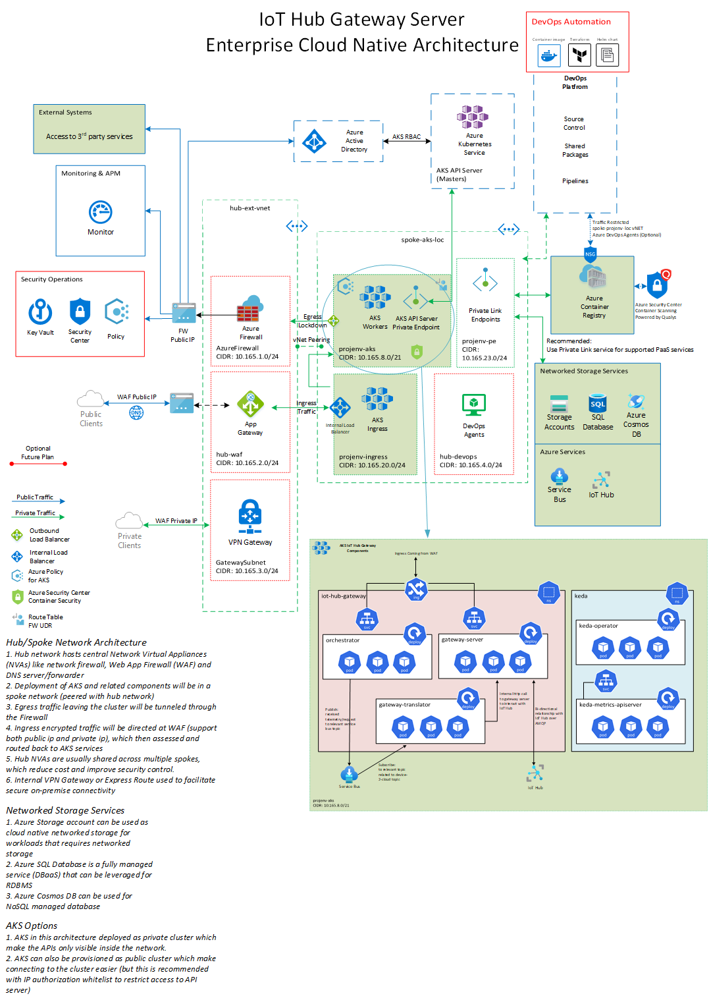
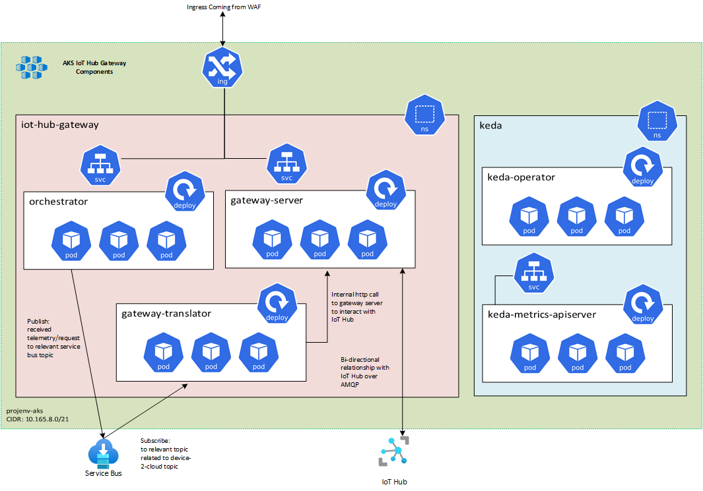

# IoT-Hub-Gateway
Cloud native IoT Hub Gateway implementation to support devices that can't connect directly to IoT Hub supported protocols

## Architecture

### Azure Architecture


### AKS Internal Architecture


## Azure Functions

Currently the project is developed using version 3.0 of Azure Functions (Azure Functions Core Tools v3.0.3442)

```bash

# Installing the tools on Ubuntu
sudo apt-get install azure-functions-core-tools-3

```

To manually build the docker file locally you can use:

```bash
docker build -t gateway-orchestrator:v1.0.0 .
```

To generate Kubernetes deployment file, you can also use (you need to replace the container registry url)

```bash

# This will generate ready to deploy manifest with all secrets and services for that particular function
func kubernetes deploy --name gateway-orchestrator --registry <container-registry-username> --dry-run

```

## KEDA

I'm using [KEDA](https://keda.sh) to automatically scale out the gateway-translator based on the lenght of the Service Bus topic.

Installing KEDA on the AKS cluster using helm v3 (just ensure the current kubectl context is set to your target AKS cluster and Helm tools are installed)

```bash

helm repo add kedacore https://kedacore.github.io/charts
helm repo update
helm search repo kedacore --devel --versions

helm upgrade --install keda kedacore/keda \
--version=2.6.1 \
--namespace keda \
--create-namespace \
--wait

# Veritfy installation of keda
kubectl get all -n keda

# Uninstall
# helm uninstall keda -n keda

```

## Dapr

Adding Dapr support for Pub/Sub on Azure Service Bus topics

You can check this [.NET Guide for Dapr](https://docs.microsoft.com/en-us/dotnet/architecture/dapr-for-net-developers/getting-started) to install and get started in .NET.

Also main [dapr docs](https://docs.dapr.io/) will be a usful resource to check out

### Local Development

In order to work with Dapr enabled applications on the development machine (sometimes called stand-alone mode), you need to install Dapr CLI to get started.

Follow the steps outlined in the docs to [install Dapr CLI](https://docs.dapr.io/getting-started/install-dapr-cli/) then follow the [initialization process](https://docs.dapr.io/getting-started/install-dapr-selfhost/) to get Dapr docker containers and files up and running

After having CLI installed, you can either use something like ```dapr run``` to run your code with Dapr support.

```bash

# Assuming you are in a terminal with context set to the target project folder
# Replace the --app-id with a value that represent the project you are working with
dapr run --app-id gateway-orchestrator --components-path ./DaprComponents dotnet run

```

Above approach is handy for quick validation of setup, but you will not have a debugging capabilities (like break points for example).

To over come this limitation, I've included a **Docker Compose** project in each service that supports Dapr, which you can easily run through Visual Studio (by selecting Docker Compose profile).

Docker compose file includes not only your application docker container, but also Dapr side-car container as well and establish communications between them (Dapr side-car communicate directly with your app container through gRPC by default).

# Deployment procedure

## Main components
Main components of the project consists of the following:
- Gateway Orchestrator: an HTTP service that provides entry point to the platform and its job to publish a message to relevant service bus topic for other services to consume
- Gateway Translator: a service that subscribe to "d2c-messages" topic and send these messages to Gateway Server to be posted to IoT Hub. It can include any transformation logic as well
- Gateway Server: an HTTP service that post Device-2-Cloud messages among other things related to acting as IoT Hub gateway (like direct method invocation and Cloud-2-Device messaging)

## Azure services required
To deploy the platform, you will need the following Azure Services provisioned:
- AKS Cluster with appropriate size (load test done with 20K concurrent devices with 8 D8s worker nodes)
- Service Bus Name Space (standard or premium based on expected load) with at least one topic named [d2c-messages] with shared access signature to be used by the platform
- IoT Hub with appropriate scale (load test done with 5 units of S2 but experienced several throttling due to reaching the limits. If this a problem consider using S3 instead)

## AKS Deployment

### Dapr on AKS

Dapr relies on injecting the dapr side-car to dapr enabled services automatically through deployment ```annotations```.

For that, you need to install Dapr primary components on AKS before you can deploy you Dapr enabled workloads.

There are couple of ways to [install Dapr on AKS](https://docs.dapr.io/operations/hosting/kubernetes/kubernetes-deploy/) (Dapr CLI or Helm), follow the documentation and install Dapr in the target AKS cluster.

```bash

# Installing using CLI is simple, just make sure that your kubernetes context is set to the right cluster on your machine
kubectl create namespace dapr
dapr init -k -n dapr
# use the below to deploy dapr in High-Availability mode if you wish
# dapr init -k -n dapr --enable-ha=true

# Validate
kubectl get pods --namespace dapr
# NAME                                    READY   STATUS    RESTARTS   AGE
# dapr-dashboard-76cc799b78-lvfdd         1/1     Running   0          4m35s
# dapr-operator-5d45c778c4-fb2bz          1/1     Running   0          4m35s
# dapr-placement-server-0                 1/1     Running   0          4m35s
# dapr-sentry-68776c58b5-k4s4d            1/1     Running   0          4m35s
# dapr-sidecar-injector-66c878c8b-vt85p   1/1     Running   0          4m35s

```

### Dapr on AKS (using Helm)

Although you can use Dapr CLI to install dapr on AKS, it is recommended to use Helm (directly or via CI/CD pipelines like GitHub Actions).

For full documentation on these recommendations, check [dapr docs](https://docs.dapr.io/operations/hosting/kubernetes/kubernetes-production/#enabling-high-availability-in-an-existing-dapr-deployment)

To install through Helm, use the following:

```bash

helm repo add dapr https://dapr.github.io/helm-charts/
helm repo update
# See which chart versions are available
helm search repo dapr --devel --versions

helm upgrade --install dapr dapr/dapr \
--version=1.6 \
--namespace dapr-system \
--create-namespace \
--set global.ha.enabled=true \
--wait

# Verify installation
kubectl get pods --namespace dapr-system
# or using dapr CLI
dapr status -k

# note to uninstall
# helm uninstall dapr --namespace dapr-system

# to upgrade with zero down time:
# 1. update the CLI (if being in use)

# 2. Update dapr control plane
# helm repo update
# helm upgrade dapr dapr/dapr --version 1.6.0 --namespace dapr-system --wait

# 3. Update dapr data plane (side cars)
# kubectl rollout restart deploy/<DEPLOYMENT-NAME>


```

### Dapr on AKS (using Azure Arc extension)

```shell

AKS_NAME=aks-weu
AKS_RG=aks-weu

az extension add --name k8s-extension
az extension update --name k8s-extension

# Enabling the features on the subscription
az feature register --namespace "Microsoft.ContainerService" --name "AKS-ExtensionManager"
az feature register --namespace "Microsoft.ContainerService" --name "AKS-Dapr"
# Checking the feature registration status
az feature list -o table --query "[?contains(name, 'Microsoft.ContainerService/AKS-ExtensionManager')].{Name:name,State:properties.state}"
az feature list -o table --query "[?contains(name, 'Microsoft.ContainerService/AKS-Dapr')].{Name:name,State:properties.state}"

# Refresh the existing registrations
az provider register --namespace Microsoft.KubernetesConfiguration
az provider register --namespace Microsoft.ContainerService

# Enabling the extension on existing AKS
az k8s-extension create \
    --cluster-type managedClusters \
    --cluster-name $AKS_NAME \
    --resource-group $AKS_RG \
    --name managedDaprExtension \
    --auto-upgrade-minor-version true \
    --configuration-settings "global.ha.enabled=true" \
    --configuration-settings "dapr_operator.replicaCount=3" \
    --extension-type Microsoft.Dapr

# Checking the deployment pods
kubectl get pods -n dapr-system

```

Once finished successfully, you can find these 4 components running on AKS:

- **dapr-operator:** Manages component updates and Kubernetes services endpoints for Dapr (state stores, pub/subs, etc.)
- **dapr-sidecar-injector:** Injects Dapr into annotated deployment pods and adds the environment variables DAPR_HTTP_PORT and DAPR_GRPC_PORT to enable user-defined applications to easily communicate with Dapr without hard-coding Dapr port values.
- **dapr-placement:** Used for actors only. Creates mapping tables that map actor instances to pods
- **dapr-sentry:** Manages mTLS between services and acts as a certificate authority. For more information read the security overview.

### Microservices Deployment

Each service containers a folder called deployment, underneath it all the required YAML manifest for AKS deployment.

You need to make some adjustments to some of the YAML files to reflect you specific environment.

Specific instructions are specified in each project in a bash script named [deployment-cmds.sh]. Follow these instructions to push each service container to Azure Container Registry and deploy then each service to AKS

# Testing
In order to test the functionality of the server, you can use something as simple as [Postman]. 
Included in the project a Postman template that can be imported for sample requests to target the deployment.
